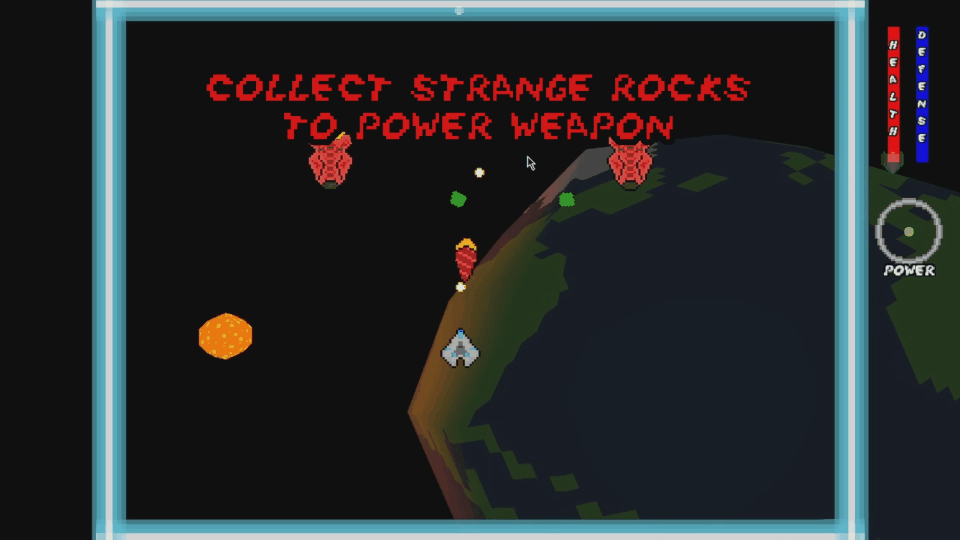
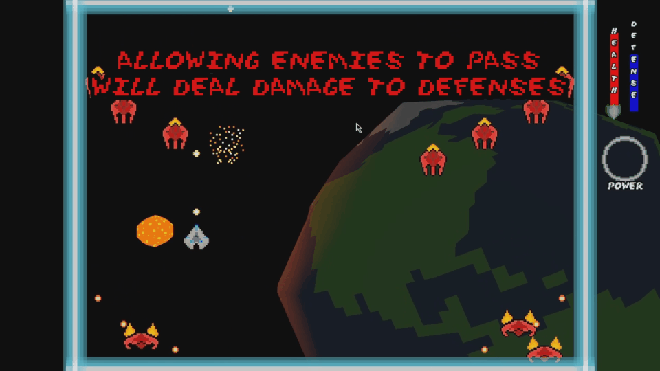
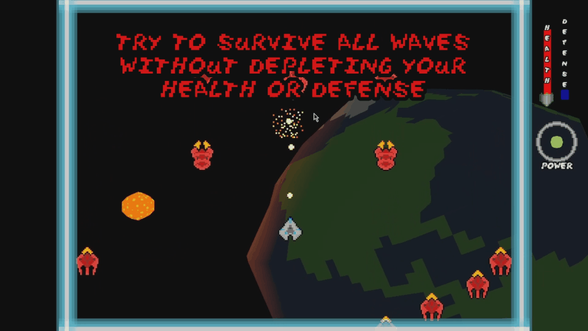

# Thetawave

## Controls

- Movement: WASD or Arrow Keys
- Fire weapon (can hold) : Spacebar or Left Click 
- Special ability (when ready): Right Click or Shift

## Description

Thetawave is an open-source game, designed to be easily expandable. It is programmed in the Rust Language using the Bevy Engine.

## Gameplay

## Credits

### Music by Joel Schuman

### Sound Effects

#### *Space Ultimate Megapack*

https://gamesupply.itch.io/ultimate-space-game-mega-asset-package

### Fonts

#### *Space Madness*

*Space Madness* by [Rose Frye](https://modernmodron.itch.io/)

Licensed under Creative Commons: By Attribution 4.0 International.

http://creativecommons.org/licenses/by/4.0/ 
