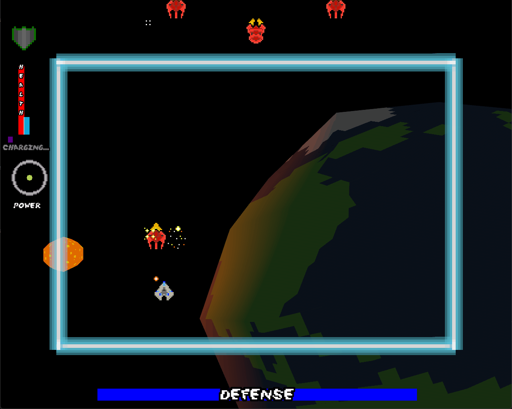

# Thetawave

- [Thetawave](#thetawave)
  - [Gameplay](#gameplay)
  - [Description](#description)
  - [Controls](#controls)
    - [Keyboard](#keyboard)
    - [Xbox Controller](#xbox-controller)
  - [Instructions](#instructions)
  - [Credits](#credits)
    - [Music by Joel Schuman](#music-by-joel-schuman)
    - [Sound Effects](#sound-effects)
      - [*Space Ultimate Megapack*](#space-ultimate-megapack)
    - [Assets](#assets)
      - [*Kadith's icons*](#kadiths-icons)
    - [Fonts](#fonts)
      - [*Space Madness*](#space-madness)

**Play in browser NOW on [itch](https://metalmancy.itch.io/thetawave)!**

## Gameplay

## Description

Thetawave is an open-source space shooter game, designed to be easily expandable. It is programmed in the Rust Language using the Bevy Engine.

## Controls

### Keyboard

- Movement: WASD or Arrow Keys
- Fire weapon (can hold) : Spacebar or Left Click 
- Special ability (when ready): Right Click or Shift

### Xbox Controller

- Movement: D-Pad
- Fire weapon (can hold) : Right bumper
- Special ability (when ready): Left bumper

## Instructions

Protect the Earth from invading enemies!

The game is lost when all players have their health bars depleted from taking damage or when the blue defense bar is depleted from letting enemies reach the bottom of the arena.

- Wrenches heal health
- Gems increase fire rate
- Armor negates damage
- Allowing cargo hauler mobs to reach the bottom of the arena heals defense

## Credits

### Music by [Joel Schuman](https://joelhasa.site/)

### Sound Effects

#### *Space Ultimate Megapack*

https://gamesupply.itch.io/ultimate-space-game-mega-asset-package

### Assets

#### [*Kadith's icons*](https://kadith.itch.io/kadiths-free-icons)

### Fonts

#### *Space Madness*

*Space Madness* by [Rose Frye](https://modernmodron.itch.io/)

Licensed under Creative Commons: By Attribution 4.0 International.

http://creativecommons.org/licenses/by/4.0/